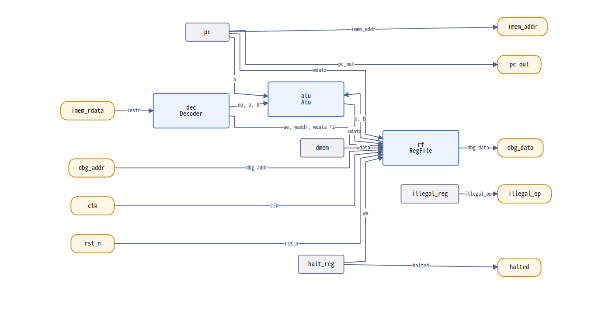
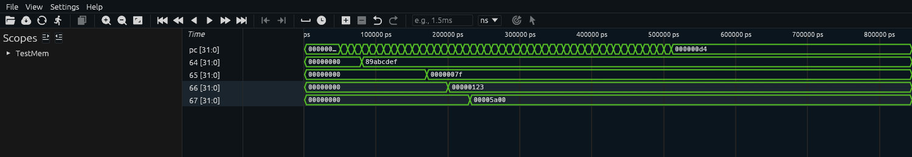

# IRIS

**(アイリス: Immutable RTL, Intentional Semantics)**

IRISは、組み合わせ回路と順序回路を記述することを前提としたハードウェア記述言語です。
人間とAIが読み書きできる、読めることに前提を起き、高級っぽく見える低レベルな言語を目指しています。

SystemVerilogの複雑さを解消し、Rustの設計思想を取り入れた次世代ハードウェア記述言語として、約220の予約語を持つSystemVerilogに対し、IRISは58語のキーワードでRTL設計に必要な表現力を提供します。

## 設計思想

| 原則 | 説明 |
|------|------|
| **Safety First** | 暗黙の型変換を廃止、ビット幅不一致はコンパイルエラー |
| **明示性 > 暗黙性** | 意図を明確にコードで表現 |
| **簡潔性** | `{}`記法、統一されたデータ型、統一された代入演算子 |
| **構成可能性** | モジュール間の疎結合設計 |
| **合成と検証の分離** | 合成可能コードと検証専用コードの明確な区別 |

## 主な特徴

- **統一代入演算子**: ブロッキング(`=`)とノンブロッキング(`<=`)の混乱を排除し、`=` に統一（`sync`ブロック内では自動的に順序回路セマンティクスで処理）
- **イミュータブル信号**: `let`による不変信号宣言を基本とし、可変信号は`var`で明示的に宣言
- **Rust風構文**: `match`式、ジェネリクス、パターンマッチングなどモダンな言語機能を採用
- **型安全性**: 暗黙の型変換を禁止、コンパイル時ビット幅チェック、明示的な型変換
- **マルチドライブ防止**: 同一信号への複数箇所からの駆動をコンパイル時に検出
- **コンテキストベース合成**: `comb`ブロックで組み合わせ回路、`sync`ブロックで順序回路を明確に分離
- **FSM専用構文**: `fsm`ブロックによる状態機械の直感的な記述
- **言語組み込み検証**: UVM不要の検証機能（テスト構文、アサーション、カバレッジ）
- **形式的等価性検証**: IRISと変換後SystemVerilogの等価性を、標本ではなく証明で確かめる

## SystemVerilogとの比較

| 機能 | SystemVerilog | IRIS |
|------|---------------|------|
| 括弧 | `begin ... end` | `{ ... }` |
| 型宣言（組み合わせ） | `wire [7:0] data` | `let data: bit[8];` |
| 型宣言（順序） | `reg [7:0] data` | `var data: bit[8];` |
| 分岐 | `case ... endcase` | `match { ... }` |
| 組み合わせ論理 | `assign` / `always_comb` | `let`宣言 / `comb { }` |
| 順序論理 | `always_ff @(posedge clk)` | `sync(clk.posedge) { }` |
| モジュール | `module ... endmodule` | `mod ... { }` |
| 代入演算子 | `=`（ブロッキング）/ `<=`（ノンブロッキング） | `=`（統一） |
| 予約語数 | 約220 | 58 |

予約語数は仕様2.4節から数えています。
SystemVerilogの約220は仕様書の記述をそのまま置いており、数え直していません。

### シミュレーション速度

カウンタを2000万サイクル回し、各3回実行して中央値を採っています。

| 実行系 | 時間 | サイクル毎秒 |
|---|---|---|
| IRIS コンパイル型（`iris-compile`） | 0.47 s | 約4260万 |
| Verilator（C++ハーネスから`eval()`） | 0.56 s | 約3570万 |

どちらもネイティブのループで駆動し、`-O3`とリンク時最適化で組んでいます。
揃えなければ、測っているのは実行系ではなくビルド指定になります。

差は設計によって変わります。
32ビットの演算を含む設計では1.06倍まで縮みます。
カウンタはIRISにとって条件の良い設計です。

4値（0、1、X、Z）の模擬はやめていません。
Verilatorは既定で2値しか持ちません。

他の言語との比較や、それぞれの利点と欠点は
[言語の比較](./doc/language_comparison.md)にまとめています。

## コード例

### カウンタモジュール

```rust
/// 8ビットカウンタ
mod Counter(
    in  clk: clock,
    in  rst: reset,
    in  enable: bit,
    out count: bit[8],
) {
    // 可変信号（レジスタ）
    var counter: bit[8] = 0;

    // 順序論理
    sync(clk.posedge, rst.async) {
        if enable {
            counter = counter + 1;
        }
    }

    // 組み合わせ論理（出力接続）
    comb {
        count = counter;
    }
}
```

### FSM（信号機）

```rust
fsm TrafficLight(clk.posedge, rst.async) {
    // 灯りは状態だけで決まるので、状態定義に付ける
    state enum {
        Red    [red_light = 1, yellow_light = 0, green_light = 0],
        Green  [red_light = 0, yellow_light = 0, green_light = 1],
        Yellow [red_light = 0, yellow_light = 1, green_light = 0],
    }
    initial: Red

    var timer: bit[8] = 0;

    transitions {
        Red => {
            when timer >= 8'd100 { timer = 0; goto Green; }
            when 1 { timer = timer + 1; }
        }
        Green => {
            when timer >= 8'd80 { timer = 0; goto Yellow; }
            when 1 { timer = timer + 1; }
        }
        Yellow => {
            when timer >= 8'd20 { timer = 0; goto Red; }
            when 1 { timer = timer + 1; }
        }
    }

    output encoding: onehot
}
```

## プロジェクト構成

```
iris/
├── spec/                  # 言語仕様書（21章構成）
├── sim/
│   ├── iris-sim/          # シミュレータ（インタプリタ + コンパイラ）
│   └── iris-runtime/      # 値、演算、波形（両実行方式が共有）
├── tools/
│   ├── irisfmt/           # フォーマッタ / リンタ
│   ├── iris2sv/           # IRIS → SystemVerilog トランスパイラ
│   ├── sv2iris/           # SystemVerilog → IRIS トランスパイラ
│   ├── conformance/       # 3つのツールを全設計に通す突き合わせ
│   ├── formal/            # IRISと変換後SystemVerilogの形式的等価性検証
│   ├── schematic/         # ブロック図ビューア（フロントエンドのみ）
│   ├── surfer-plugin/     # Surferの翻訳プラグイン
│   └── veryl2iris/        # VerylとIRISの相互変換
├── example/
│   ├── async_fifo/        # 非同期FIFO（2クロックドメイン、SystemVerilog変換つき）
│   ├── riscv/             # RV32Iプロセッサ（単サイクル、40命令）
│   ├── counter/           # 単一クロックカウンタ（速度比較に使用）
│   └── comparison/        # SystemVerilog、Verylとの比較の再生成
├── doc/                   # 言語比較、形式検証、ブロック図、波形の資料
└── LICENSE                # MIT License
```

## ツール

### シミュレーション（Rust製）

**iris-sim**：IRISシミュレータ

インタプリタモードとコンパイラモードの2つの実行方式を提供します。

```bash
# インタプリタモード（直接実行）
cargo run --bin iris-sim -- -i input.iris -o output.vcd -c 100

# コンパイラモード（Rust実行ファイルを生成する）
cargo run --bin iris-compile -- -i input.iris -o input_sim --release
./input_sim -c 100 -o output.vcd
```

どちらも同じ設計を受け付け、同じ波形を出力します。
コンパイラモードはリリースビルドでインタプリタの約93倍速く動きます。

**iris-formal**：形式的等価性検証のための基準モデル生成

IRISの設計から、構造的なSystemVerilogのモデルを出します。
`iris2sv`の出力を証明する相手であり、`tools/formal`が使います。

```bash
cargo run --release --bin iris-formal -- -i input.iris -o out/
```

**iris-runtime**：ランタイムライブラリ

IRISの値とその演算、波形の記録とVCD出力を提供するライブラリです。
インタプリタとコンパイラモードで生成された実行ファイルの双方がこれを使うため、
同じ設計はどちらで実行しても同じ結果になります。

### ユーティリティ（TypeScript製）

**irisfmt**：フォーマッタとリンタ

IRISソースコードの自動整形とコーディング規約チェックを行います。

**iris2sv**：IRISからSystemVerilogへのトランスパイラ

IRISソースをSystemVerilogに変換し、既存のEDAツールで使用可能にします。
モジュール、ジェネリックパラメータ、`comb`／`sync`ブロック、`mem`、インスタンス、
`fsm`、`enum`、`struct`、`union`、`interface`、`fn`、`extern mod`、`package`、
テストベンチを変換します。
変換できない構文は黙って無視せず、診断を出して失敗します。
対応範囲の詳細は[iris2svのREADME](./tools/iris2sv/README.md)を参照してください。

**sv2iris**：SystemVerilogからIRISへのトランスパイラ

既存のSystemVerilogコードをIRISに変換し、レガシーコードベースからの移行を支援します。
テストベンチの時間制御（`#5ns`、`initial`）は読めますが、
IRISはクロックもリセットも宣言から駆動するため戻す先が無く、診断を出します。

**tools/conformance**：3つのツールの突き合わせ

全設計を3つのツールに通し、次の不変条件を確かめます。

- 出力器が書いたものを`iris-sim`が読み、評価できる
- `iris-sim`が読む設計を`iris2sv`と`irisfmt`が読む
- 整形しても、変換して戻しても、模擬結果が変わらない
- 変換したテストベンチがVerilatorで`iris-sim`と同じ結果を出す
- 扱えない入力は黙って消えず、診断が出る

```bash
tools/conformance/run.sh
```

**tools/formal**：形式的等価性検証

IRISの設計と、`iris2sv`がそれを変換したSystemVerilogが同じ回路であることを、
すべての入力と到達しうるすべての状態について証明します。

```bash
tools/formal/run.sh
```

`example/`の6設計すべてについて、段数無しで証明されています。

| 設計 | IRISとの等価性 | 往復の等価性 |
|---|---|---|
| `alu`、`decoder` | proven | proven |
| `counter`、`regfile` | proven | proven |
| `async_fifo` | proven | proven |
| `riscv_core` | proven | proven |

往復とは、`iris2sv`から`sv2iris`を経由して`iris2sv`へ戻す経路のことです。

**ベクタは差を見つけることしかできず、差が無いことは言えません。**
`example/comparison/equiv/`のテストベンチは33,024本の入力を与えますが、
ALUの入力空間は2^68通りあり、その10^-15にも満たない標本です。

判定は「証明した」「反例付きで否定した」「試していない、理由はこれ」の3つだけです。
**`skipped`は合格ではありません。**

仕組みは[`doc/formal_verification.md`](./doc/formal_verification.md)、
使い方は[`tools/formal/README.md`](./tools/formal/README.md)にあります。

**tools/schematic**：ブロック図ビューア

IRISの設計のモジュール接続をブラウザで描きます。
**フロントエンドのみで動き、サーバは要りません。**
構文解析器`@iris2sv/core`がすでにTypeScriptなので、
選んだ`.iris`はブラウザの外に出ません。

```bash
cd tools/schematic && npm install && npm run dev
```



箱は3種で、インスタンス（青）、境界端子（橙）、レジスタ（灰）です。
レジスタを箱にするのは、`comb`を辿った線がレジスタをまたいで
「同じサイクルで値が届く」と嘘をつくのを防ぐためです。

**IRISの結線は半分しか明示されていません。**

| 対象 | 節点 | 書いてある線 | 辿って得た線 |
|---|---|---|---|
| `RiscvCore` | 16 | 4 | **20** |
| `example/`と`fixtures/`の全体 | 32 | 12 | **27** |

`RiscvCore`の線は24本のうち20本が、`comb`と`sync`を辿らないと出ません。

詳細は[`doc/schematic.md`](./doc/schematic.md)、
[`tools/schematic/README.md`](./tools/schematic/README.md)にあります。

**tools/surfer-plugin**：Surferの翻訳プラグイン

[Surfer](https://surfer-project.org/)で波形を読むための拡張です。
**Surfer本体は同梱していません。**

```bash
iris-sim -i design.iris -o out.vcd --dump-arrays
surfer out.vcd
```



`--dump-arrays`を付けると、`mem`が1要素1変数のスコープとして波形に出ます。
上の図の`64`から`67`は`mem dmem`の64番地から67番地です。

| | `$var`の数 |
|---|---|
| 既定 | 91 |
| `--dump-arrays` | 1147（`dmem`1024語と`regs`32語） |

符号付きの`int[N]`は`$var integer`として書くので、負の値が負として出ます。

詳細は[`doc/surfer_plugin.md`](./doc/surfer_plugin.md)、
[`tools/surfer-plugin/README.md`](./tools/surfer-plugin/README.md)にあります。

**tools/veryl2iris**：VerylとIRISの相互変換

[Veryl](https://veryl-lang.org/)との間でソースコードを変換します。

```bash
veryl2iris design.veryl    # Veryl -> IRIS
iris2veryl design.iris     # IRIS  -> Veryl
```

**どちらの言語仕様も変えないので、共通部分でしか完全になりません。**
その外は落とさず、位置を添えて拒否します。

| 拒否の種類 | 例 |
|---|---|
| 言語に対応物が無い | `f32`、`tri`、`bind`（Veryl側）／`fsm`、`rand`（IRIS側） |
| この変換器が未実装 | `interface`、`function`、複数値のcaseアーム |

往復は模擬実行で一致することを`tools/conformance/run.sh`が検査します。
`example/`の6設計すべてが往復します。
対応表で`Exact`と書いた30行のうち、24行に往復の断片があります
（残り6行は理由を表が持っています）。
複数のファイルは1つのプロジェクトとして渡してください。

```bash
iris2veryl decoder.iris regfile.iris alu.iris riscv_core.iris
```

詳細は[`doc/veryl.md`](./doc/veryl.md)、
[`tools/veryl2iris/README.md`](./tools/veryl2iris/README.md)にあります。

## サンプル

**example/async_fifo**：非同期FIFO（2クロックドメイン、GRAY符号ポインタ同期）

3つの経路で動作を確認しており、いずれも同じ結果になります。

```bash
cd example/async_fifo/sim && ./run.sh              # インタプリタ
cd example/async_fifo/sim && ./run_compiled.sh     # コンパイル型
cd example/async_fifo/sv  && ./run.sh              # SystemVerilog（Verilator）
```

**example/riscv**：RV32Iプロセッサ（単サイクル）

RISC-Vの基本整数命令セット40命令を実装しています。
期待値はRISC-Vの仕様から導いており、命令の符号化は`riscv64-unknown-elf-as`で組み立てています。

```bash
cd example/riscv/sim && ./run.sh              # インタプリタ
cd example/riscv/sim && ./run_compiled.sh     # コンパイル型
cd example/riscv/sv  && ./run.sh              # SystemVerilog（Verilator）
```

同じコアが3つの実行方式で同じ答えを出します。

```
  instructions verified: 40 / 40
  RESULT: PASS - all 40 RV32I instructions behave as the specification requires
```

**example/counter**：単一クロックカウンタ。
実行方式の速度比較に使用します。

## クイックスタート

### 前提条件

- **Rust**（rustc、cargo）：シミュレータのビルドに必要
- **Node.js**（18.0.0以上）と**pnpm**：TypeScript製ツールのビルドに必要

### シミュレータのビルドと実行

```bash
# iris-simのビルド
cd sim/iris-sim
cargo build --release

# シミュレーションの実行
cargo run --bin iris-sim -- path/to/your_design.iris
```

### TypeScript製ツールのビルド

```bash
# iris2svの例
cd tools/iris2sv
pnpm install
pnpm build
```

`package.json`の`packageManager`が`pnpm@9.0.0`を指しているため、
pnpm 10で実行すると別バージョンへ切り替えようとして失敗することがあります。
その場合は次のように切り替えを無効にしてください。

```bash
pnpm install --config.manage-package-manager-versions=false
pnpm -r --config.manage-package-manager-versions=false build
```

## 言語仕様

完全な言語仕様書は [spec/iris_spec.md](./spec/iris_spec.md) にあります。
21章構成で、以下のトピックを網羅しています。

| 章 | タイトル | 内容 |
|----|----------|------|
| 1 | 概要 | 設計思想、SystemVerilogとの比較 |
| 2 | 字句構造 | 予約語、リテラル、演算子 |
| 3 | 型システム | プリミティブ型、複合型、ジェネリクス |
| 4 | モジュール定義 | ポート、信号、インスタンス化 |
| 5 | 組み合わせ論理 | `let`宣言、`comb`ブロック |
| 6 | 順序論理 | `sync`ブロック、クロック/リセット |
| 7 | FSM | 状態機械の記述 |
| 8 | インターフェース | ビュー、接続規則 |
| 9 | 演算子 | 算術、ビット、比較、論理 |
| 10 | メモリ | RAM/ROM宣言 |
| 11 | 検証機能 | テスト、アサーション、カバレッジ |
| 12 | パッケージシステム | インポート、公開制御 |
| 13 | アトリビュート | 合成指示、階層制御 |
| 14 | エラーメッセージ | エラーコード体系 |
| 15 | 移行ガイド | SystemVerilog → IRIS変換 |
| 16 | 文法定義 | EBNF形式の完全文法 |
| 17 | サンプルコード集 | カウンタ、FIFO、AXI、SPI等 |
| 18 | 用語集 | 技術用語の定義 |
| 19 | FAQ | よくある質問と回答 |
| 20 | チュートリアル | 初心者向けガイド |
| 21 | IDE連携ガイド | VS Code、Neovim等の設定 |

## ファイル拡張子

| 拡張子 | 説明 |
|--------|------|
| `.iris` | **推奨**。プロジェクトでの使用を推奨する正式拡張子 |
| `.irs` | 便宜のための短縮形。正式拡張子と同等に扱う |

すべてのIRISツール（iris-sim, irisfmt, iris2sv等）は両方の拡張子を同等に認識します。

## ドキュメント

`doc/`に資料があります。日本語を既定とし、`_en`付きが英語版です。

| 資料 | 内容 |
|---|---|
| [言語の比較](./doc/language_comparison.md) | IRIS、SystemVerilog、Verylの構文、記述量、速度 |
| [Verylとの相互変換](./doc/veryl.md) | 何が変換でき、何ができないか |
| [形式的等価性検証](./doc/formal_verification.md) | IRISと変換後SystemVerilogが同じ回路であることの証明 |
| [仕様書と実装の差](./doc/grammar_gaps.md) | 仕様書のコード例のうち構文解析を通らないもの |
| [ブロック図ビューア](./doc/schematic.md) | モジュール接続をブラウザで描く |
| [Surferでの波形表示](./doc/surfer_plugin.md) | 波形を読み、`mem`を要素ごとに展開する |

リポジトリ直下の`report_*.md`は資料ではなく**作業の記録**です。
経緯、測定、判断、そこで出た誤りを残しています。

| | 何か | 読み手 |
|---|---|---|
| `doc/*.md` | 成果物の説明。何がどう動くか | 道具を使う者 |
| `report_*.md` | その作業の記録 | 作業を追う者 |

## 現在のステータス

- **バージョン**: 0.8.0（開発中）
- **仕様書日付**: 2026-08-09
- **対応SystemVerilog**: IEEE 1800-2017準拠を目標
- **形式的等価性**: `example/`の6設計すべてについて、IRISと変換後SystemVerilogの等価性を段数無しで証明済み（`tools/formal/run.sh`）
- **可視化**: ブロック図をブラウザで表示（`tools/schematic`）、波形をSurferで表示し`mem`を要素ごとに展開（`iris-sim --dump-arrays`）

## ライセンス

[MIT License](./LICENSE)
