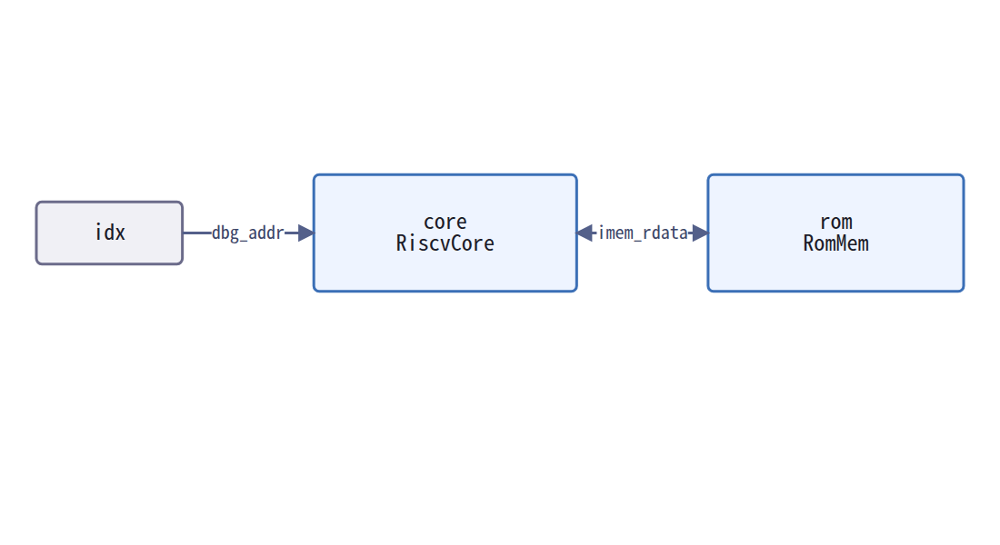

# IRISのブロック図

## この資料が扱うもの

IRISで書いた設計の、モジュール接続をブラウザで描く道具である。

```bash
cd tools/schematic
npm install
npm run dev
```

**サーバは無い。**
組み立てると静的なファイル2つになり、選んだ`.iris`はブラウザの外に出ない。


## なぜサーバが要らないのか

手本にしたModViewはPythonのバックエンドを持っている。
SystemVerilogを解析するVeribleが C++ の実行ファイルであり、
ブラウザの中で動かせないからである。

**IRISにはその理由が無い。**
構文解析器`@iris2sv/core`はすでにTypeScriptで書かれている。

```
$ grep -rn "from 'node:\|require('fs'" packages/core/src/
（該当なし）

$ npm run build
dist/index.html                    3.28 kB
dist/assets/index-*.js         1,948.24 kB │ gzip: 587.72 kB
```

束ねた結果にNodeの組み込みは0件、外部URLも0件である。

**ただし作業量が減るわけではない。**
手本の内訳を測ると、消えるのは777行、TypeScript側へ移るだけのものが732行ある。
「バックエンドが消える」は配置の話であって、作業量の話ではない。

## 何を描くか

箱は3種ある。

| 箱 | 何か | 見た目 |
|---|---|---|
| インスタンス | 下位モジュールの実体 | 青の長方形。上が実体名、下がモジュール名 |
| 境界端子 | 描いているモジュールのポート | 橙の丸い箱 |
| レジスタ | `sync`で代入される信号、すなわち状態 | 灰の長方形 |

線の上の文字は、その線が運ぶポート名である。
同じ2つの箱を結ぶ線は1本にまとめる。

```
imem_rdata ──instr──→ dec ──op, a, b──→ alu ──a, b──→ rf ──dbg_data──→ dbg_data
                       │                              ↑
                       └──we, waddr, wdata +2─────────┘
```

### レジスタを箱にする理由

`comb`の連鎖をそのまま辿ると、レジスタを1段またいだ線が引ける。
その線は「同じサイクルで値が届く」と言うが、実際には次のサイクルに届く。

**状態で伝播を止めれば、その嘘が出ない。**

## 線の半分は書かれていない

**これがこの道具の中心にある事実である。**

IRISの結線は半分しか明示されていない。

```rust
inst rf = RegFile { waddr: dec.rd, };     // dec -> rf、書いてある
```

しかし多くは`comb`で作った中間信号を指す。

```rust
comb { alu_a = if dec.alu_a_pc { pc } else { rf.rdata1 }; }
inst alu = Alu { a: alu_a, };             // rf -> alu、書いていない
```

書いてある線だけを描くと、図はほとんど空になる。

| 対象 | 節点 | 書いてある線 | 辿って得た線 |
|---|---|---|---|
| `RiscvCore` | 16 | 4 | **20** |
| `example/`と`fixtures/`の全体 | 32 | 12 | **27** |

**`RiscvCore`の線は24本のうち20本が、`comb`と`sync`を辿らないと出ない。**

画面の下に両方の数を出している。
図が何を根拠に描かれたかを、読む者が確かめられるようにするためである。

### 辿り方

```
1. comb の代入から、信号ごとの源を集める
2. sync の代入先はレジスタとして記録し、そこで伝播を止める
3. 源が FieldExpr ならインスタンス出力
   源が入力ポートなら境界端子
   それ以外なら再帰する
4. 同じ名前を2度辿らない
```

## 実装で避けた3つの罠

**素朴に書いた試作は、3回とも間違った図を出した。**

| | 罠 | 何が起きるか | 直し方 |
|---|---|---|---|
| 1 | `load_byte.sign_extend[32]()`が`alu.y`と同じ`FieldExpr`に見える | 実在しないインスタンスの箱が出る | インスタンス名の集合で区別する |
| 2 | `comb`を辿るとレジスタを1段またぐ | サイクルの意味が消える | `sync`の代入先で止める |
| 3 | 自己ループが出る | 構造について何も言わない線が出る | 同上 |

3つとも`src/model/build.test.ts`に試験がある。

## 描画して初めて出た3つの問題

**モデルの試験と組み立ての成功だけでは、1つも出なかった。**

ヘッドレスのChromeで実際に描かせて見つけたものである。

| | 症状 | 直し方 |
|---|---|---|
| 1 | ポート5本のラベルが箱に重なった | 先頭3つと残りの数にした（`we, waddr, wdata +2`） |
| 2 | 線の付かないレジスタが浮いていた | 描かないことにした |
| 3 | 図が左上に寄り、下半分が空いた | 描画の完了を待ってから収めるようにした |

3番目は実装の誤りだった。
紙が`async`であり、描画が終わる前に大きさを測っていた。



2番目は上の図に効いている。
`TestMem`の`done`、`cycles`、`fails`は状態だが、
インスタンスにも境界にも繋がらないため描いていない。

**インスタンスと境界ポートは、繋がっていなくても描く。**
繋がっていない下位モジュールや宙に浮いたポートは、それ自体が見るべきものだからである。

## 構文解析に失敗したファイル

**落とさずに報告する。**

図からモジュールが消えているとき、
元から無かったのか、読めなかったのかは、図を見ても分からない。
読めなかったファイルは左下に理由とともに出す。

## 操作

| 操作 | 効果 |
|---|---|
| 箱を掴んで動かす | 落とすたびに全部の線を引き直す |
| 何もない所を掴む | 図を動かす |
| `Fit` | 全体を画面に収める |
| `+` / `−`、Ctrl+ホイール | 拡大縮小 |
| `Save layout` | 並びをJSONで保存する |
| `Load layout` | 保存した並びを戻す |

## 配置

手本と同じELKを使う。

```
elk.algorithm          layered
elk.direction          RIGHT
elk.edgeRouting        ORTHOGONAL
elk.hierarchyHandling  INCLUDE_CHILDREN
```

境界端子は層の制約で左端と右端に固定してある。
制約を与えないと`clk`が、それが刻む設計の真ん中に置かれる。

16節点17辺で54.9ミリ秒だった。
**この規模で速度は問題にならない。**

## 構成

```
src/
├── main.ts             起動と操作
├── model/
│   ├── types.ts        図のモデル
│   ├── build.ts        IRISのAST -> 図のモデル
│   └── build.test.ts   罠を含む試験
└── diagram/
    ├── layout.ts       ELKによる配置と配線、ラベルの整形
    ├── layout.test.ts  ラベルの試験
    └── render.ts       JointJSによる描画
```

`model/`はブラウザに依存しない。
そのため配線の推論は画面を出さずに試験できる。

```
$ npm test
Test Files  2 passed (2)
      Tests  13 passed (13)
```

## 依存

| 部品 | ライセンス | 役割 |
|---|---|---|
| `@iris2sv/core` | MIT | IRISの構文解析。同じリポジトリ内 |
| `@joint/core` | MPL-2.0 | 図形と線 |
| `elkjs` | EPL-2.0 | 層別配置と直交配線 |

MPL-2.0とEPL-2.0はファイル単位のコピーレフトである。
npmの依存として変更せずに使うかぎり、このツール自身のMITに影響しない。
手本のModViewも同じ判断をしている。

## 確かめていないこと

**階層の入れ子を確かめていない。**

インスタンスがさらにインスタンスを持つとき、
手本は入れ子の容器として描く。
このリポジトリにはそういう設計が1つも無いため、試しようがない。

**対応があることを理由に、動くとは書かない。**
