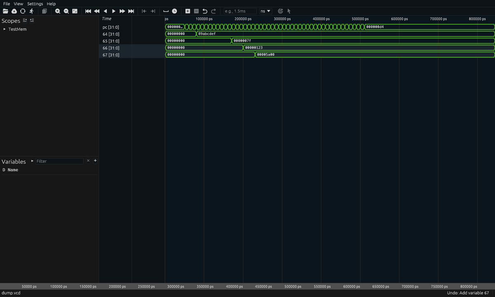

# Surferでの波形表示

## この資料が扱うもの

IRISの模擬実行が出した波形を[Surfer](https://surfer-project.org/)で読み、
**多次元配列を要素ごとに展開する**仕組みである。

```bash
iris-sim -i design.iris -o out.vcd --dump-arrays
surfer out.vcd
```


上の図の`64`から`67`は`mem dmem`の64番地から67番地である。
それぞれ別の時刻に、別の値へ書き変わっている。

## 作業はビューアの側に無かった

**Surferには必要な機能がすでにあった。**

| 求めるもの | Surferにあるもの |
|---|---|
| 波形を読む | VCD、FST、GHW |
| 配列を見る | 配列はスコープ。要素は変数 |
| 展開する | スコープを開けば要素が並ぶ |
| 拡張する | Extismの翻訳プラグイン |

**足りなかったのはIRISが出す波形の側である。**

着手前はこうだった。

```
$ grep -nF 'dmem' example/riscv/sim/output_mem.vcd
100:$var wire 32 z core.dmem_rdata [31:0] $end
```

`mem dmem: bit[32][1024]`のうち、波形に出ていたのは読み出し口の値1本だけである。
**配列そのものが1語も出ていなかった。**

展開すべきものがファイルに無いので、ビューアをいくら直しても展開するものが無い。

## 3つを直した

```
段0  識別子の衝突        VCDの識別子が94本で一周していた
段1  階層               $scope が1つしか無かった
段2  配列               mem が要素として出ていなかった
```

### 段0 識別子が94本で一周していた

信号が94本を超えると、95本目が1本目と同じ符号を受け取っていた。
警告は出ない。

```
$ grep -cF '$var' idov.vcd
102
$ grep -F '$var' idov.vcd | awk '{print $4}' | LC_ALL=C sort -u | wc -l
94
$ grep -F '$var' idov.vcd | awk '$4=="!"{print $5}'
clk s92
```

94は`'!'`から`'~'`までの個数そのものである。
既存の設計は91本で、**上限まで3本しかなかった。**

識別子は文字の列であってよいので、94進で割り当てるようにした。
**94本目までは今までと同じ1文字を返すため、既存の波形は変わらない。**

配列を出すと1147本になる。上限の12倍であり、これを先に直す必要があった。

### 段1 階層を入れ子にした

名前がすでに階層を持っていた。

```
$var wire 5 7 dut.wr_ptr [4:0] $end
```

点で区切って木に組み替えるだけでよく、記録側は変えていない。

```
$scope module TestMem $end
$scope module rom $end
$upscope $end
$scope module core $end
$scope module dec $end
$upscope $end
$scope module rf $end
$upscope $end
$scope module alu $end
$upscope $end
$upscope $end
$upscope $end
```

**設計の構造そのものである。**

### 段2 配列をスコープとして出した

`--dump-arrays`で、要素1つが変数1つになる。

```
$scope module dmem $end
$var wire 32 | 0 [31:0] $end
$var wire 32 } 1 [31:0] $end
$var wire 32 ~ 2 [31:0] $end
   ...
$upscope $end
```

既定では出さない。
`dmem`は1024語であり、毎回出すと波形が10倍以上になる。

| | `$var`の数 | 大きさ |
|---|---|---|
| 既定 | 91 | 従来どおり |
| `--dump-arrays` | 1147 | 200,130バイト |

### 要素の名前に角括弧は使えない

**設計では要素を`[0]`と名付けるつもりだった。**
測ると、角括弧を含む名前は1つも読み込まれない。

| 要素名 | `scope_add`が読み込んだ数 |
|---|---|
| `[2]` | **0** |
| `dmem[2]` | **0** |
| `2` | **4** |

読む側が角括弧を添字の注記として扱い、名前として扱わないためである。
そのため要素名は`0`、`1`、`2`とした。

## 使い方

```
$ iris-sim -i test_mem.iris riscv_core.iris ... -o dump.vcd -c 200 --dump-arrays
$ surfer dump.vcd
```

Surferの中で、またはコマンドで。

```
scope_add TestMem.core.dmem            メモリ全体を並べる（1024変数）
variable_add TestMem.core.dmem.3       3番地だけを出す
```

存在しない添字は見つからないと報告される。

```
variable_add TestMem.core.dmem.9999    => Failed to find variable
```



## 符号付きの表示

IRISの`int[N]`は2の補数である。
その情報はVCDには型名として入らない。

**VCDが持っている語彙で表す。**
`iris-sim`は符号付きの信号を`$var integer`として書く。

```
$var integer 32 ; s_rs1 [31:0] $end
$var wire    32 z dmem_rdata [31:0] $end
```

これでSurferが符号付きとして扱い、負の値が負として出る。

**この1点だけで目的は達せられる。**
Surferには`Signed`という組み込みの翻訳器があり、`$var integer`を受け持つ。

## 浮動小数点の表示

`f32`と`f64`はビット列のまま出すと読めない。
`iris-sim`は浮動小数点の信号を`$var real`として書き、値の変化は十進で出す。

```
$var real 1 # y $end
...
r1.5 #
```

これでSurferやGTKWaveが`1.5`と表示する。`0x3FC00000`ではない。

## 翻訳プラグイン

`tools/surfer-plugin/`にExtismのプラグインがある。

```
$ cargo build --release --target wasm32-unknown-unknown --ignore-rust-version
$ cp target/wasm32-unknown-unknown/release/iris_surfer_translator.wasm \
     ~/.local/share/surfer/translators/
```

Surferを起動すると読み込まれる。

```
INFO libsurfer::translation::wasm_translator: Found .../iris_surfer_translator.wasm
INFO libsurfer: Translator IRIS loaded
```

`Translator IRIS loaded`の`IRIS`は、このプラグインの`name()`が返した文字列である。
Surferの原本が`info!("Translator {} loaded", t.name())`と書いている。
壊れた`.wasm`を置くと`Failed to load plugin from`が出る。

### 仕組み

**ExtismでありWITでもコンポーネントモデルでもない。**

| 項目 | 値 |
|---|---|
| 機構 | Extism 1.21.0 |
| 型 | `surfer-translation-types` v0.7.0（タグ固定のgit依存） |
| 必須の関数 | `name` / `translates` / `variable_info` / `translate` |

`surfer-translation-types`はSurferの一部でEUPL-1.2である。
**依存として参照しており、このリポジトリに複製していない。**
Surfer本体も同梱していない。

### このプラグインが今できること

**正直に書く。**

プラグインは読み込まれ、Surferから呼ばれている。
それは次の警告で確かめられる。

```
WARN libsurfer::wave_data: More than one preferred translator for
     variable s_rs1 in scope TestMem.core: IRIS, Signed
```

Surferがこの警告を出すのは、**プラグインの`translates`を呼び、その答を受け取ったから**である。

一方で、**画面に出ている値はSurfer組み込みの`Signed`が作ったものである。**
`$var integer`を組み込みの翻訳器も受け持つため、そちらが選ばれる。

判別のため、出力に印を付けた版を一時的に作って確かめた。
印は画面に出なかった。

**したがって現状はこうである。**

| | 状態 |
|---|---|
| プラグインが読み込まれる | **確認済み** |
| Surferがプラグインを呼ぶ | **確認済み** |
| プラグインの出力が画面に出る | **未確認** |
| 符号付きが正しく出る | **確認済み。ただし組み込みの`Signed`による** |

VCDが運べる型情報は`wire`と`integer`の区別しか無い。
その区別で足りる範囲は組み込みが既に覆っている。

**プラグインの値は、VCDが運べない情報をIRIS側から渡せるようになったときに出る。**
現時点では、その口が用意してあるということ以上を主張しない。

## 確かめた環境

| 道具 | 版 |
|---|---|
| `surfer` | 0.7.0 |
| `extism-pdk` | 1.4 |
| `surfer-translation-types` | v0.7.0 |
| `cargo` / `rustc` | 1.91.1 |

`--ignore-rust-version`が要る。
Surferの型定義が依存する`ecolor`がrustc 1.92以上を求めるためである。
1.91.1で組み立てて動くことは確かめてある。
